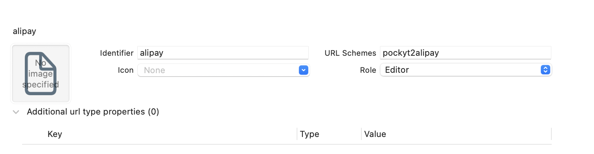
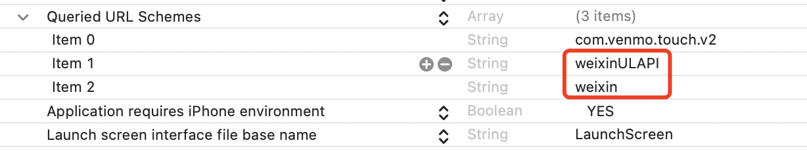
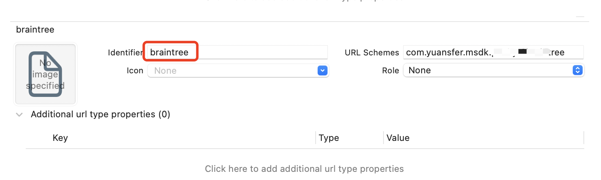
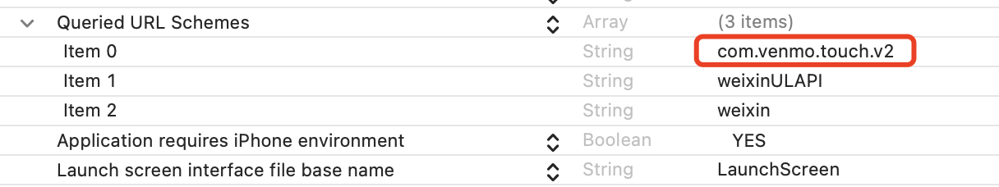
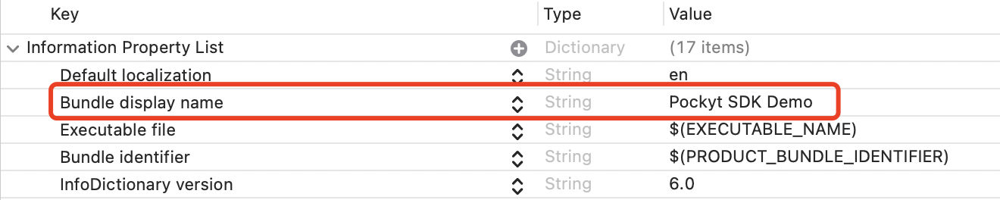
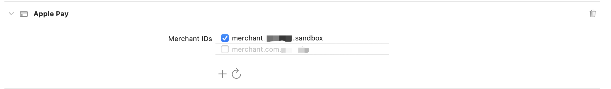
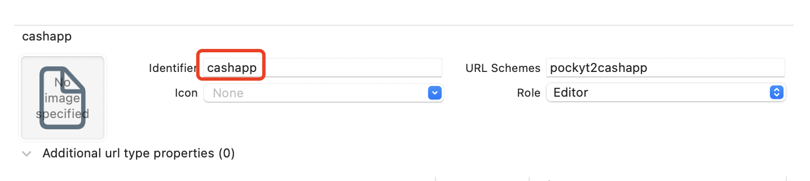

## Introduction

[](https://cocoapods.org/pods/Pockyt)  
This is a payment sdk that supports mainstream payment methods such as WeChat Pay, Alipay, Cash App and Braintree etc.

## Getting Started

- Before integrating the payment, please contact the Pockyt team to create an account. We may require you to submit documentation files.
- For Wechat Pay, configure the bundle identifier and universal links in the WeChat Open Platform. [official guide](https://developers.weixin.qq.com/doc/oplatform/Mobile_App/Access_Guide/iOS.html)
- For Braintree, please contact the Pockyt team to confirm the payment mode. When integrating with Braintree, you will need to create an account and configure it on the official platform.[official guide](https://developer.paypal.com/braintree/docs/guides/overview)

## Installation

- Pockyt is available through CocoaPods, Due to the independence of payment methods, 
you are free to choose which payment methods you want to install and combine. 
Pockyt includes Alipay and WeChat Pay by default, if only these two methods are needed.
To install it, simply add the following line to your Podfile:
```ruby
  pod 'Pockyt'
```
- Below are the separate installation forms for various payment methods, to be downloaded as 'Pockyt/xxx' sub-components. 
It is important to note that 'Pockyt/DropIn' will automatically include other Braintree payment methods. 
DropIn is a quick integration method using the official UI library, however you still need to import the submodules from the SDK for easy usage. while non-DropIn methods require individual addition of each payment component.
```ruby
  pod 'Pockyt/WechatPay'
  pod 'Pockyt/Alipay'
  pod 'Pockyt/DropIn'
  pod 'Pockyt/ApplePay'
  pod 'Pockyt/CardPal'
  pod 'Pockyt/Venmo'
  pod 'Pockyt/ThreeDSecure'
  pod 'Pockyt/DataCollect'
  pod 'Pockyt/CashApp'
```

## Configuration

### Alipay
- In Xcode, select your project's settings, choose the "TARGETS" tab, and then select the "info" tab. Under the "URL Types" section, add the Identifier as "alipay". Please note that "alipay" is a fixed term and cannot be changed, as it will affect the integration of Alipay. Add a "URL Scheme" with the application identifier, such as "pockyt2alipay". It is recommended to have a distinctive identifier that does not overlap with other merchant apps. Otherwise, it may result in the inability to correctly redirect back to the merchant's app from Alipay.
<div align=center>

</div>

### WeChat Pay
- In Xcode, select your project's settings, choose the "TARGETS" tab, and then select the "info" tab. Under the "URL Types" section, add a "URL Scheme" with the application ID that you have registered.
<div align=center>

</div>

- In Xcode, select your project's settings, choose the "TARGETS" tab, and then select the "info" tab. Under the "Queried URL Schemes" section, add "weixin" and "weixinULAPI".
<div align=center>

</div>

- Configuring Universal Links for the application.
1. Configure Universal Links for your application according to the [apple documentation](https://developer.apple.com/documentation/xcode/allowing-apps-and-websites-to-link-to-your-content).  
2. In Xcode, Turn on the "Associated Domains" switch and add the Universal Links domain to the configuration. 
<div align=center>

</div>
3. Please go to the WeChat Open Platform - Developer Application Registration page to register. After registering and selecting the mobile application for configuration, you will obtain an App ID that can be used immediately for development. However, after the application registration is completed, it still needs to go through the submission and review process. Only applications that pass the review can be officially published and used.  

### Drop-in UI
- Xcode 12+
- A minimum deployment target of iOS 12.0
- Swift 5.1+ (or Objective-C)

### Venmo
- In Xcode, select your project's settings, choose the "TARGETS" tab, and then select the "info" tab. Under the "URL Types" section, Add the Identifier as "braintree". Please note that "braintree" is a fixed term and cannot be changed, as it will affect the integration of Venmo.
    Add a "URL Scheme" with the application identifier, such as "pockyt2braintree".
<div align=center>

</div>

- You must add the following to the queries schemes allowlist in your app's info.plist:
<div align=center>

</div>

- You must have a display name in your app's info.plist to help Venmo identify your application:
<div align=center>

</div>

### Apple Pay
- In order to use Apple Pay on a real device, you must configure an Apple Pay Merchant ID and an Apple Pay payment processing certificate in Apple's Developer Center, [offical guide](https://developer.paypal.com/braintree/docs/guides/apple-pay/configuration/ios/v5).
- In Xcode, enable Apple Pay under Capabilities in your Project Settings. Then enable both Apple Pay Merchant IDs. It is important that you compile your app with a provisioning profile for the Apple development team with an Apple Pay Merchant ID. Apple Pay does not support enterprise provisioning.
<div align=center>

</div>

### Cash App
- In Xcode, select your project's settings, choose the "TARGETS" tab, and then select the "info" tab. Under the "URL Types" section, Add the Identifier as "cashapp". Please note that "cashapp" is a fixed term and cannot be changed, as it will affect the integration of Cash App.
    Add a "URL Scheme" with the application identifier, such as "pockyt2cashapp".
<div align=center>

</div>

## How to use

### Swift language

- First, import the library at the top of the class file.
```swift
import Pockyt
```
- For WeChat Pay, Alipay, Venmo and Cash App, you need to override the following methods in the AppDelegate:
```swift
func application(_ application: UIApplication, open url: URL, sourceApplication: String?, annotation: Any) -> Bool {
    return Pockyt.shared.handleOpenURL(url)
}
  
@available(iOS 9.0, *)
func application(_ application: UIApplication, open url: URL, options: [UIApplication.OpenURLOptionsKey : Any] = [:]) -> Bool {
    return Pockyt.shared.handleOpenURL(url)
}

// For WeChat Pay
func application(_ application: UIApplication, continue userActivity: NSUserActivity, restorationHandler: @escaping ([UIUserActivityRestoring]?) -> Void) -> Bool {
    return Pockyt.shared.handleOpenUniversalLink(userActivity)
}
```
- If your application has adapted to SceneDelegate, please configure the following code in the SceneDelegate:
```swift
func scene(_ scene: UIScene, openURLContexts URLContexts: Set<UIOpenURLContext>) {
    if let urlContext = URLContexts.first {
        Pockyt.shared.handleOpenURL(urlContext.url)
    }
}
  
// For WeChat Pay
func scene(_ scene: UIScene, continue userActivity: NSUserActivity) {
    Pockyt.shared.handleOpenUniversalLink(userActivity)
}
```
- After calling the Pockyt prepayment API(`/micropay/v3/prepay` or `/online/v3/secure-pay`), create a payment object and call the Pockyt.shared.requestPay method.
```swift
// For Alipay
let payment = Alipay(payInfo)
Pockyt.shared.requestPay(payment) { result in
    print("Paid: \(result.isSuccessful), cancelled: \(result.isCancelled), \(result)")
}

// For WeChat Pay
let request = WechatPayRequest(partnerId: partnerid, prepayId: prepayid, packageValue: package, nonceStr: noncestr, timeStamp: timestamp, sign: sign)
Pockyt.shared.requestPay(WechatPay(request)) { result in
    print("Paid: \(result.isSuccessful), cancelled: \(result.isCancelled), \(result)")
}

// For Drop-in UI
let dropReq = BTDropInRequest()
// BTDropInRequest has many configuration options
// ThreeDSeucre for card, optional
// dropReq.threeDSecureRequest = createThreeDSecure()
let payment = DropInPay(uiViewController: self, clientToken: authorization, dropInRequest: dropReq)
Pockyt.shared.requestPay(payment) { result in
    if let nonce = result.dropInResult?.paymentMethod?.nonce{
        print("Obtained nonce: \(result.isSuccessful), cancelled: \(result.isCancelled), nonce: \(nonce)")
    } else if .applePay == result.dropInResult?.paymentMethodType {
        print(result.respMsg)
        // Note that Apple Pay requires continuing the payment flow initiation
        self.startApplePay()
    } else if let error = result.respMsg {
        print("Failed to obtain nonce, cancelled: \(result.isCancelled), error: \(error)")
    } else {
        print("Failed to obtain nonce, cancelled: \(result.isCancelled)")
    }
}

// For PayPal
let request = BTPayPalCheckoutRequest(amount: "1.00")
let request = BTPayPalVaultRequest()
let paypal = PayPal(authorization: HttpUtils.CLIENT_TOKEN, paypalRequest: request)
Pockyt.shared.requestPay(paypal) { result in
    if result.isSuccessful {
        if let nonce = result.paypalAccountNonce?.nonce {
            print("Obtained nonce: \(nonce)")
        } else {
            print("Failed to obtain nonce")
        }
    } else {
        print("Failed to obtain nonce, error: \(result.respMsg ?? "Unknown error")")
    }
}

// For Venmo
let request = BTVenmoRequest()
request.paymentMethodUsage = .multiUse
let venmo = Venmo(authorization: HttpUtils.CLIENT_TOKEN, venmoRequest: request)
Pockyt.shared.requestPay(venmo) { result in
    if result.isSuccessful {
        if let nonce = result.venmoNonce?.nonce {
            print("Obtained nonce: \(nonce)")
        } else {
            print("Failed to obtain nonce")
        }
    } else {
        print("Failed to obtain nonce, error: \(result.respMsg ?? "Unknown error")")
    }
}

// For Apple Pay, There are a few additional steps in the payment process compared to the ones mentioned above
// First, initialize the Apple Pay request parameters
let applePay = ApplePay(viewController: self, authorization: HttpUtils.CLIENT_TOKEN)
applePay.initPaymentRequest() { paymentRequest, error in
    if let paymentRequest = paymentRequest {
        print("Payment request initialized")
        self.showApplePaySheet(paymentRequest: paymentRequest)
        self.presentAuthorizationViewController(applePay)
    } else {
        print("Failed to initialize payment request")
    }
}
// Secondly, present the Apple Pay sheet
private func showApplePaySheet(paymentRequest: PKPaymentRequest) {
    paymentRequest.requiredBillingContactFields = [.postalAddress]
    // Set other PKPaymentRequest properties here
    paymentRequest.merchantCapabilities = .capability3DS
    paymentRequest.paymentSummaryItems =
    [
        PKPaymentSummaryItem(label: "test_item", amount: NSDecimalNumber(string: "0.02")),
        // Add add'l payment summary items...
        PKPaymentSummaryItem(label: "Pockyt.io", amount: NSDecimalNumber(string: "0.02")),
    ]
    // ...
}
// Then, present the Apple Pay authorization view controller
private func presentAuthorizationViewController(_ applePay: ApplePay) {
    applePay.requestPay() { result in
        if result.isSuccessful {
            print("Payment processing, please wait...")
            self.submitNonceToServer(applePay: applePay, transactionNo: "xxx", nonce: result.applePayNonce!.nonce)
            print("Payment successful, nonce: \(result.applePayNonce!.nonce)")
        } else {
            print(result.respMsg)
        }
    }
}
// Finally, Submit the Apple Pay nonce to your server, Notify the Apple Pay wallet of the payment status based on the API result
if (apiSuccess) {
    applePay.notifyPaymentCompletion(true)
} else {
    applePay.notifyPaymentCompletion(false)
}

// For Cash App
let request = OneTimeRequest(scopeId: scopeId, amount: amount)
let payment = CashApp(clientId: clientId, request: request)
Pockyt.shared.requestPay(payment) { result in
    print("Approved: \(result.isSuccessful), Declined: \(result.isDeclined), \(result.respMsg ?? "")")
    if (result.isSuccessful) {
        self.queryTransactionResult(transactionNo)
    }
}
```
- For Braintree, After obtaining the nonce from the payment result, call the Pockyt process API (`/creditpay/v3/process`) to complete the payment.

### Objective-C language
- First, import the library at the top of the '.m' file.
```objc
#import "Pockyt-Swift.h"
```
- Please refer to the above configuration in Swift to add the configuration for returning to the application from the payment application in either AppDelegate or SceneDelegate.
- In Objective-C language, instead of calling the unified Pockyt's requestPay method, the payment can be initiated directly through the corresponding payment implementation class's requestPay method.
```objc
// For Alipay
Alipay *alipay = [[Alipay alloc] initWithPayInfo:payInfo fromScheme:@"pockytToalipay"];
[alipay requestPayWithCompletion: ^(AlipayResult * result) {
    NSLog(@"Alipay result: %d, %d, %@", result.isSuccessful, result.isCancelled, result.memo);
}];

// For WeChat Pay
WechatPayRequest *request = [[WechatPayRequest alloc] initWithPartnerId:partnerId prepayId:prepayId packageValue:packageValue nonceStr:nonceStr timeStamp:timeStamp sign:sign];
WechatPay *wechatPay = [[WechatPay alloc] init:request];
[wechatPay requestPayWithCompletion:^(WechatPayResult * result) {
    NSLog(@"Wechat Pay result: %d, %d, %@", result.isSuccessful, result.isCancelled, result.respMsg);
}];

// Other payment methods are similar
// ...
```
## Note

- The 'deviceData' is used to reduce the chargeback rate. It is recommended to use the collectData method of DataCollector to obtain and submit the data to the server for processing.
- If you pass a 'customerNo' when generating a client token, Drop-in will display that customer's saved payment methods and automatically add any newly-entered payment methods to their Vault record. [create customer api](https://docs.pockyt.io/reference/register-customer)
    If vaulted payment methods exist, this is how they will appear in Drop-in.
- For other detailed usage, please refer to the example program.
